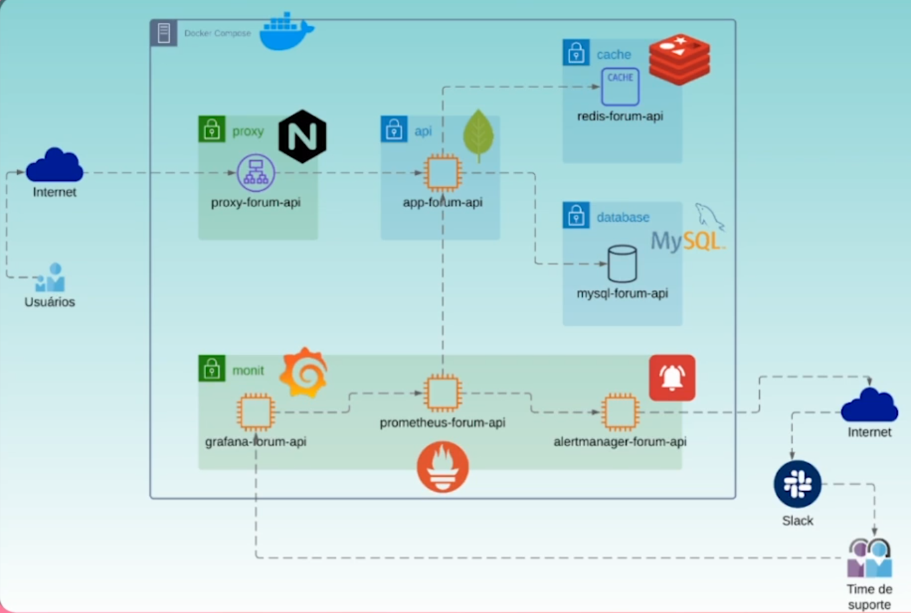
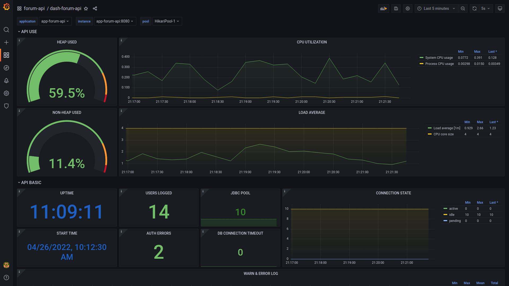
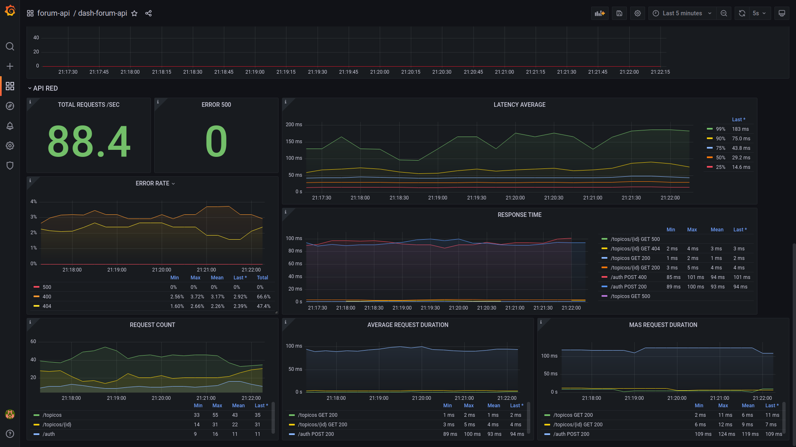

# Observabilidade - Prometheus e Grafana

Curso de observabilidade da Alura utilizando Prometheus e Grafana. A aplicação a ser monitorada é um Spring Boot.

<div align="center"></div>

## Tecnologias

- [Prometheus](https://prometheus.io/docs/introduction/overview/)
- Grafana
- Spring Boot
- Docker
- [Micrometer](https://micrometer.io/docs)
- [Spring Metrics](https://docs.spring.io/spring-metrics/docs/current/public/prometheus)

### Dashboard Grafana

Visualizações criadas no grafana:

<table border="0" style="text-align: center; justify-content: center; align-items: center; ">
  <tr>
      <td style="text-align: center">
          
          </br>
      </td>
      <td style="text-align: center">
          
          </br>
      </td>
  </tr>
</table>
  
### Configuração do ambiente

Estamos utilizando o docker, para rodar os container rode o seguinte comando:

``` bash
docker-compose up -d
```

Na pasta [client](./client) temos um simulador de chamadas para criar as métricas necessárias.

## Anotações

- Adicionando configurações do actuator

``` xml
# actuator
management.endpoint.health.show-details=always
management.endpoints.web.exposure.include=health,info,metrics
```

- Endpoints do actuator
    - [GET] [/actuator/health](http://localhost:8080/actuator/health)
    - [GET] [/actuator/metrics](http://localhost:8080/actuator/metrics)
    - [GET] [/actuator/prometheus](http://localhost:8080/actuator/prometheus)

- É possível adicionar métricas personalizadas com ``io.micrometer.core.instrument``
- Configurando o healthcheck pelo docker-compose

``` yaml
  healthcheck:
    test: "curl -sS http://app-forum-api:8080/actuator/health"
    interval: 1s
    timeout: 30s
    retries: 60
```

- Tipos de métricas Prometheus
    - **Counter**
        - É uma métrica acumulativa que representa um único contador que sempre será incrementado. Não use um contador
          para expor um valor que pode diminuir. Por exemplo, não use um contador para o número de processos em execução
          no momento; em vez disso, use um Gauge.
    - **Gauge**
        - É uma métrica que representa um valor número que pode crescer e diminuir. Os medidores são normalmente usados
          para valores medidos como temperaturas ou uso de memória atual, mas também "contagens" que podem aumentar e
          diminuir, como o número de solicitações simultâneas.
    - **Histogram**
        - O *histogram* mostra observações com durações ou tamanhos de resposta. Ele também fornece uma soma de todos os
          valores observados.
    - **Summary**
        - Muito parecido com o histogram, embora também forneça uma contagem total de observações e uma soma de todos os
          valores observados, ele calcula quantis configuráveis em uma janela de tempo deslizante.

- Golden Signals
    - Latência
    - Tráfego
    - Saturação
    - Erros

- A pasta do [grafana](./grafana) precisa ter permissão 777
- Documentação uso do grafana com prometheus - https://grafana.com/docs/grafana/latest/datasources/prometheus/

## Referência

- [Observabilidade: coletando métricas de uma aplicação com Prometheus](https://cursos.alura.com.br/course/observabilidade-prometheus)
- [Monitoramento: Prometheus, Grafana e Alertmanager](https://cursos.alura.com.br/course/monitoramento-prometheus-grafana-alertmanager)

---
Desenvolvido por [Jean Jacques Barros](https://github.com/jjeanjacques10)